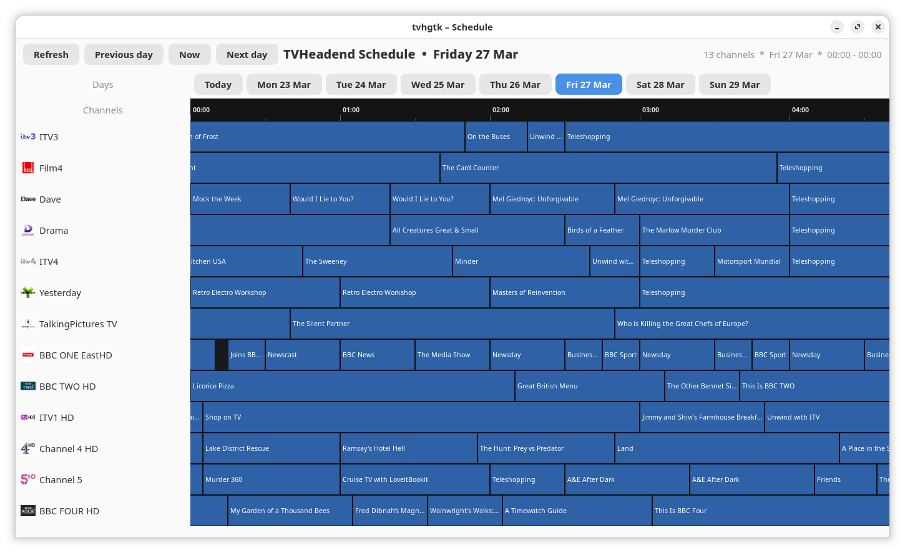
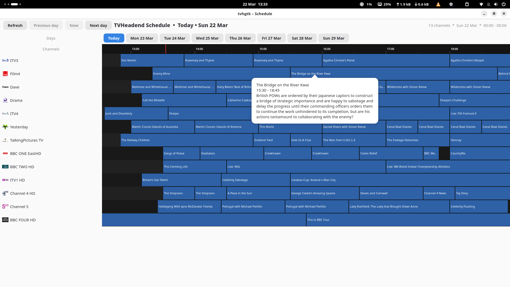

# tvhgtk

A GTK4 desktop client for [TVHeadend](https://tvheadend.org/), written in Python.

Displays an 8-day EPG (Electronic Programme Guide) grid with channels on the
left and a proportional 24-hour timeline across the top. Built with PyGObject,
Cairo, and Pango.


---

## Features





- **EPG grid** — channels as rows, proportional programme cells drawn with Cairo/Pango
- **8-day schedule** — day selector strip at the top; browse up to 8 days ahead
- **Programme details on click** — click a programme cell to show title, time, and description
- **Responsive layout** — 20/80 channel/schedule split that adapts when the window is resized or maximised
- **Current-time marker** — red vertical line on both the timeline and each channel row
- **Icon cache** — channel icons loaded from `~/.cache/tvhgtk/icons/` (by UUID or normalised name)
- **Keyboard navigation** — see below

## Keyboard shortcuts

| Key | Action |
|-----|--------|
| `h` or `←` | Scroll schedule left 1 hour |
| `l` or `→` | Scroll schedule right 1 hour |
| `End` | Scroll to end of day (midnight) |
| `H` or `Shift+←` | Previous day |
| `L` or `Shift+→` | Next day |
| `Home` | Jump to today |

## Requirements

- Python ≥ 3.14
- GTK 4
- [PyGObject](https://pygobject.gnome.org/) ≥ 3.56
- pycairo
- [tvheadend](https://github.com/ccdale/tvheadend) Python library
- A running [TVHeadend](https://tvheadend.org/) server

## Installation

```bash
# Clone the repo
git clone https://github.com/ccdale/tvhgtk.git
cd tvhgtk

# Install with uv
uv sync
```

> **Note:** the `tvheadend` library dependency currently points to a local git
> source in `pyproject.toml`. Update `[tool.uv.sources]` to match your setup
> (or a published PyPI release when one is available).

## Configuration

Create `~/.config/tvhgtk/config` (mode `600`):

```ini
[server]
url = http://your-tvheadend-host:9981
username = your-username
password = your-password

# Optional: category block colors in the EPG grid
# Format: fill_hex,border_hex (or fill_hex only; border is auto-darkened)
[category_colors]
news = #3868b3,#132a4d
sport = #2f8f4d,#174428
film = #8f3d3d,#4a1f1f
drama = #6a4aa3,#2f1f4a
comedy = #a77a31,#4e3813
documentary = #2f8a8a,#184545
children = #b07431,#533313
music = #8a5a40,#3f291d
```

`[category_colors]` is optional. If omitted, tvhgtk uses built-in defaults.

## Channel icons

Icons are loaded from `~/.cache/tvhgtk/icons/`. Filenames should be either:

- `<channel-uuid>.<ext>` — matched first
- `<normalised-channel-name>.<ext>` — fallback (lowercase, non-alphanumeric replaced with `-`)

Supported formats: `.png`, `.jpg`, `.jpeg`, `.svg`, `.webp`

A `channel_uuid_mapping.csv` is generated on first run to help you rename icons
to the correct UUIDs.

## Running

```bash
uv run tvhgtk
```

Or, after installing into a virtual environment:

```bash
tvhgtk
```

## GNOME desktop launcher

This repository includes desktop integration assets in `assets/desktop/`:

- `assets/desktop/tvhgtk` — executable wrapper script
- `assets/desktop/tvhgtk.desktop` — desktop entry
- `assets/desktop/tvhgtk.svg` — app icon (TV over calendar)

Install them to your user directories:

```bash
mkdir -p ~/.local/bin ~/.local/share/applications ~/.local/share/icons/hicolor/scalable/apps

ln -sf "$PWD/assets/desktop/tvhgtk" ~/.local/bin/tvhgtk
install -m 0644 assets/desktop/tvhgtk.desktop ~/.local/share/applications/tvhgtk.desktop
install -m 0644 assets/desktop/tvhgtk.svg ~/.local/share/icons/hicolor/scalable/apps/tvhgtk.svg

update-desktop-database ~/.local/share/applications || true
```

The wrapper will determine your repo path automatically when symlinked from
`assets/desktop/tvhgtk`, and then runs:

```bash
cd "<detected-repo-root>"
uv run tvhgtk
```

Optional override:

```bash
TVHGTK_REPO=/path/to/tvhgtk ~/.local/bin/tvhgtk
```

## License

[GPL-3.0-only](LICENSE)
